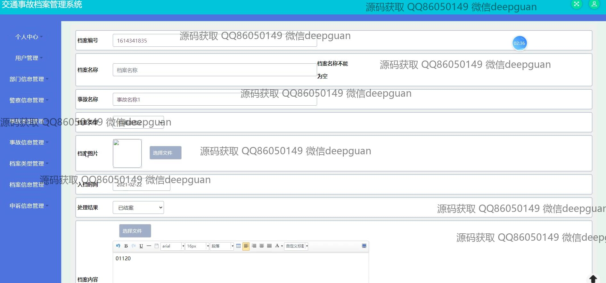

<h1 align="center">的交通事故档案管理系统</h1>

## 简介
交通事故档案管理系统：角色分为管理员、用户；提供用户管理、事故信息管理、警察信息管理、申诉信息管理、档案查询和类型管理功能，实现交通事故的高效录入、查询和处理。    --计算机毕业设计源码；毕设源码；java毕业设计源码

## 联系方式

<h3 align="center">获取完整代码与数据库文件 + 微信：deepguan QQ: 86050149 QQ群: 783742310</h3>

<h3 align="center">可帮忙远程部署 包运行成功！提供远程部署、修改代码、设计文档指导、代码讲解等服务！</h3>

## 功能介绍（完整见运行截图）
管理员：基本功能包括登录、注册和退出，能够通过用户管理模块进行用户的添加、修改和删除操作。可以通过部门信息管理、警察信息管理模块维护相关部门和警员信息。可以在事故类型管理和档案类型管理模块中，增删和查阅各类交通事故及档案的相关数据。还能审核和处理用户提交的事故信息和申诉请求。

用户：基本功能包括登录、注册和退出，进入系统后可以通过个人中心查看和更新自己的信息。可在事故信息管理模块中录入或修改交通事故信息，包括事故名称、事故类型、车牌、发生原因等详细数据。在申诉信息模块提交申诉材料，并跟踪申诉的审核状态及结果。可以查询或下载与自己账户关联的所有事故和申诉档案。

警员：在警察信息管理模块录入或更新警员个人信息，包括警员编号、姓名、身份证和联系电话等。可以通过事故信息管理功能参与录入、更新和管理与自己职责相关的交通事故数据。能够审核和处理由用户提交的事故信息及申诉内容。

## 运行截图

本代码来源于网络,仅供学习参考使用!

